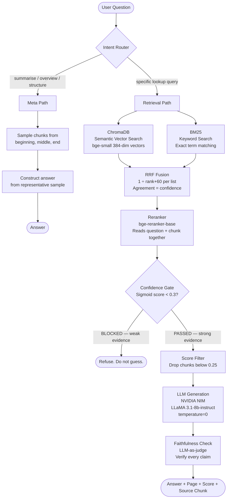
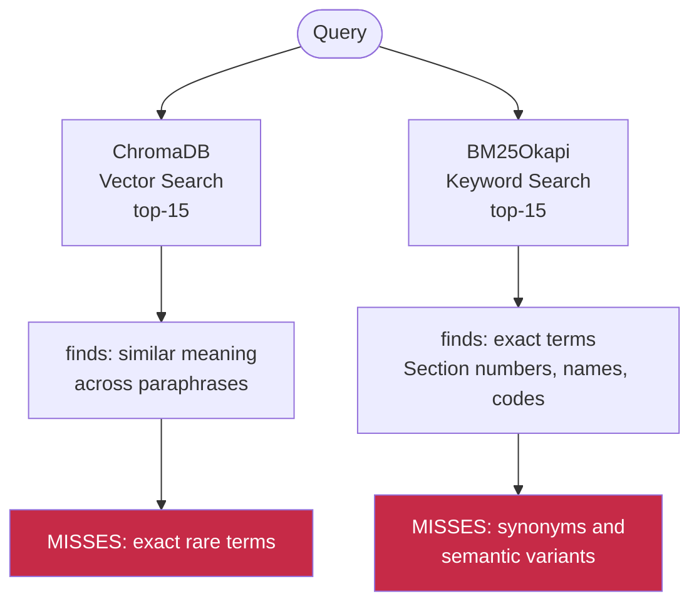
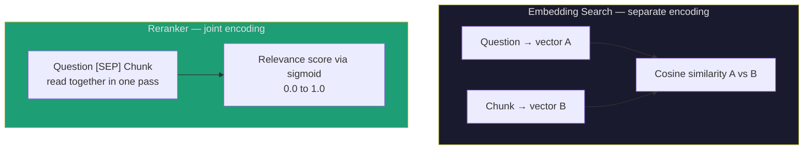
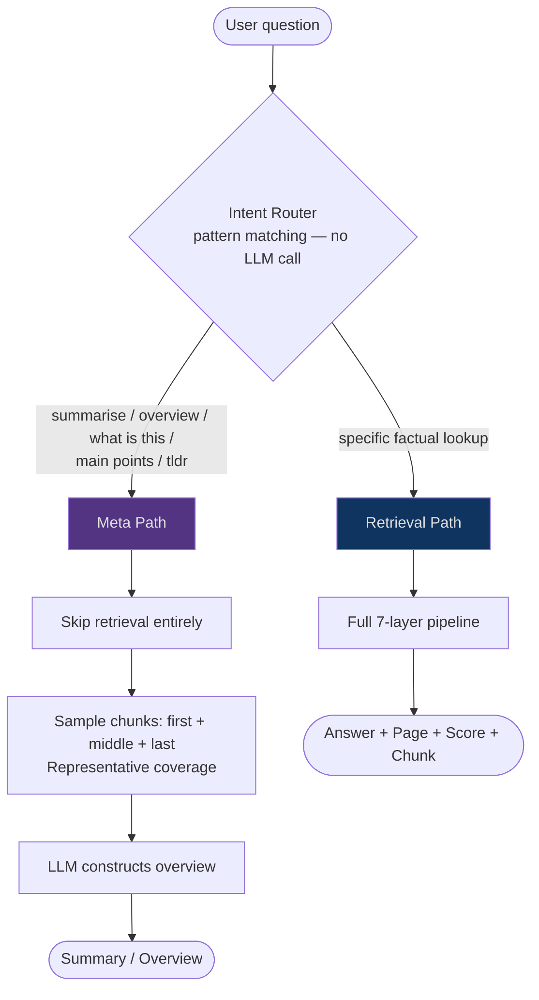

<div align="center">

# LexAI

### Document Intelligence System — Anti-Hallucination RAG Pipeline

**Ask anything about your documents.**
**Every answer traced. Every claim proven. Zero hallucinations by design.**


</div>

---

## What Is LexAI

LexAI is a production-grade Retrieval-Augmented Generation system with a 7-layer anti-hallucination pipeline. Upload any PDF or text document and ask questions — every answer is traced to a specific page and source chunk, or refused entirely if the evidence is too weak.

Most AI tools hallucinate. They mix document content with training knowledge and present both with equal confidence. You cannot tell which is which. You cannot cite an AI response.

LexAI solves this with one hard rule:

> **Every answer comes from the uploaded document with a source citation, or it is not given at all.**

---

## Architecture Overview



---

## The 7-Layer Anti-Hallucination Pipeline

Every query passes through seven layers. Each layer exists because the one before it has a specific weakness.


### Layer 1 — Smart Ingestion
**Problem it solves:** Basic PDF extraction destroys two-column layouts and misreads column order.

**Decision:** PyMuPDF (`fitz`) with layout-aware extraction reads each page's blocks, detects the column midpoint, and reads left column top-to-bottom then right column top-to-bottom. The references section is stripped before chunking — "attention", "BERT", "transformer" in references no longer pollute retrieval results.

---

### Layer 2 — Semantic Chunking
**Problem it solves:** Naive character splitting cuts sentences mid-meaning.

**Decision:** Custom sentence-based chunker targeting **400 words per chunk with 40-word overlap**. Sentence boundaries are respected — chunks never break mid-sentence. The 40-word overlap tail ensures no finding or fact is split across chunk boundaries.

---

### Layer 3 — Hybrid Retrieval
**Problem it solves:** Pure vector search misses exact rare terms. Pure keyword search misses synonyms.



**Decision:** Run both independently. Retrieval k=15 for each. Owner-scoped at the query level — documents are never visible across users. Optional `files` parameter narrows search to specific uploaded documents.

---

### Layer 4 — Reciprocal Rank Fusion
**Problem it solves:** Two ranked lists need to be merged intelligently. A chunk appearing in both lists is stronger evidence.

**The formula:**
```
RRF Score = Σ  1 / (rank + 60)
             across all retrievers

Chunk ranked #1 by both:   1/(1+60) + 1/(1+60) = 0.0328
Chunk ranked #1 by one:    1/(1+60) + 0         = 0.0164
```

The constant 60 smooths the curve. Agreement between two independent search methods is a strong signal of genuine relevance. Top 15 candidates pass to the reranker.

---

### Layer 5 — Reranker
**Problem it solves:** Embedding search encodes question and chunk *separately*. They never read each other.



**Decision:** `bge-reranker-base` cross-encoder reads question and chunk together. Raw logit output converted via sigmoid to 0–1 before threshold comparison. Top 5 chunks pass forward. Chunks scoring below 0.25 are then dropped before generation — only well-grounded context reaches the LLM.

**Why sigmoid matters:**
```
Raw reranker logit range: -10 to +10
Threshold of 0.3 would block everything (logits never reach 0.3 naturally)

After sigmoid: 1 / (1 + e^(-x))
  -8.0 → 0.0003   (correctly blocked)
  -4.0 → 0.018    (weak, blocked)
   0.0 → 0.500    (neutral)
  +4.0 → 0.982    (strong, passed)
  +8.0 → 0.9997   (near certain)
```

---

### Layer 6 — Confidence Gate
**Problem it solves:** Weak evidence fed to an LLM produces hallucination. The LLM fills gaps from training knowledge when context is thin.

**Decision:** Hard threshold at sigmoid score **0.30**. Below it — refuse entirely. The system responds: *"I don't know — your documents don't contain this."* and shows the best score it found.

> A refused answer is infinitely better than a hallucinated one.

---

### Layer 7 — Faithfulness Check
**Problem it solves:** Even with strong retrieval, the LLM can add unsupported claims during generation.

**Decision:** LLM-as-judge. After generation, a second LLM call verifies: *"Is every claim in this answer directly supported by the sources? YES or NO."* The verdict is returned alongside the answer. Generation uses `temperature=0` to eliminate random variation.

---

## The Two Query Paths

Not all questions need retrieval. Sending "summarise this document" through a retrieval pipeline fails — no chunk talks about summarising. The intent router detects query type before any processing begins.



---

## RAGAS Evaluation

Evaluated against 14 questions drawn from real uploaded documents (11 factual + 3 "trick" questions where the correct answer is genuinely not in the documents). Judge LLM: `meta/llama-3.1-8b-instruct` via NVIDIA NIM. Embeddings: `BAAI/bge-small-en-v1.5` (local).

| Metric | Score | What it measures |
|---|---|---|
| **Faithfulness** | **0.5476** | % of answer claims directly supported by source chunks |
| **Answer Relevancy** | **0.6770** | How directly the answer addresses the question asked |
| **Context Precision** | **0.3679** | % of retrieved chunks that were actually relevant |
| **Context Recall** | **0.4667** | % of relevant document content successfully retrieved |

*Run with `Evaluvate.py` — queries scoped to relevant documents, local embeddings for answer relevancy, NVIDIA NIM as judge LLM.*

---

## API Endpoints

The FastAPI backend exposes five endpoints:

| Method | Path | Purpose |
|---|---|---|
| `GET` | `/health` | Liveness check — returns paper count and chunk count |
| `POST` | `/upload` | Upload a `.pdf` or `.txt` — multipart: `file` + `owner_id` |
| `POST` | `/query` | Ask a question — JSON: `question`, `owner_id`, optional `files` |
| `GET` | `/papers` | List uploaded documents for an owner — query param: `owner_id` |
| `POST` | `/reset` | Clear all documents and history |

**Query response shape:**
```json
{
  "refused": false,
  "answer": "...",
  "verified": true,
  "citation": "filename.pdf · p.3",
  "confidence": 87,
  "label": "High",
  "sources": [
    { "file": "filename.pdf", "page": 3, "score": 87, "text": "..." }
  ]
}
```

---

## Project Structure

```
new_rag/
├── lexai/
│   ├── backend/
│   │   ├── lexai_engine.py      # Core 7-layer RAG pipeline
│   │   ├── api.py               # FastAPI server — all endpoints
│   │   ├── Evaluvate.py         # RAGAS evaluation suite
│   │   ├── chroma_store/        # ChromaDB persistent vector store
│   │   ├── mcp_server/          # MCP server — exposes backend as Claude Desktop tools
│   │   │   ├── server.py        # FastMCP server with 3 tools
│   │   │   ├── requirements.txt # mcp[cli], httpx, python-dotenv
│   │   │   ├── .env             # LEXAI_BACKEND_URL + LEXAI_OWNER_ID (never committed)
│   │   │   ├── .env.example     # Template
│   │   │   └── README.md        # Setup + Claude Desktop config instructions
│   │   ├── .env                 # API keys (never committed)
│   │   ├── .env.example         # Template — required keys
│   │   └── requirements.txt     # Backend dependencies
│   └── frontend/
│       ├── src/
│       │   ├── App.jsx          # React application
│       │   ├── main.jsx         # Entry point
│       │   └── index.css        # Styles (light + dark mode)
│       ├── index.html
│       └── package.json
└── README.md
```

---

## Setup

**1. Clone and create environment**
```bash
git clone https://github.com/ishwaryaaaaaaaaa/lexai.git
cd lexai/backend
python -m venv .venv
.venv\Scripts\activate        # Windows
# source .venv/bin/activate   # Mac/Linux
pip install -r requirements.txt
pip install langchain-openai langchain-huggingface  # for eval
```

**2. Set up environment variables**
```bash
cp .env.example .env
# Edit .env and add your NVIDIA NIM API key:
# NVIDIA_API_KEY=nvapi-...
```

**3. Run the backend**
```bash
uvicorn api:app --host 0.0.0.0 --port 8000 --reload
# First run downloads bge-small and bge-reranker (~220MB total, once only)
```

**4. Run the frontend**
```bash
cd ../frontend
npm install
npm run dev
# Opens at http://localhost:5173
```

**5. Upload a document and query it**
```bash
# Upload
curl -X POST http://localhost:8000/upload \
  -F "file=@your_document.pdf" \
  -F "owner_id=your-user-id"

# Query
curl -X POST http://localhost:8000/query \
  -H "Content-Type: application/json" \
  -d '{"question": "What is the main finding?", "owner_id": "your-user-id"}'
```

---

## Running the RAGAS Evaluation

```bash
cd lexai/backend

# Make sure the backend is running first (see above)

# Run evaluation — takes 3-5 minutes, makes real NVIDIA API calls
python Evaluvate.py

# Results printed to console + saved to ragas_results.csv
```

---

## Technical Decisions

| Decision | Alternative considered | Why this choice |
|---|---|---|
| `bge-small` not `bge-large` | bge-large (1024-dim, 1.3GB) | RAM constraint — bge-large alone exceeds available memory |
| ChromaDB persistent on disk | In-memory vector store | Disk persistence means re-embedding happens once, not every restart |
| BM25 alongside ChromaDB | Vector search only | BM25 catches exact technical terms vector search blurs |
| RRF for fusion | Weighted average of scores | RRF uses rank not magnitude — immune to score scale differences between retrievers |
| Cross-encoder reranker | No reranker | Cosine similarity compares embeddings separately; cross-encoder reads both together — far more precise |
| Sigmoid on reranker output | Raw logit comparison | Raw logits range -10 to +10; threshold of 0.3 would block everything. Sigmoid normalises to 0–1. |
| Confidence gate at 0.30 | Always attempt answer | Weak evidence + LLM = hallucination. Refusing is correct behaviour. |
| Chunk score filter at 0.25 | Pass all reranked chunks | Weak chunks in generation context increase hallucination risk; filtering improves faithfulness |
| `temperature=0` for generation | temperature=0.2 | Deterministic output; any variance increases the chance of claims not grounded in the source |
| FastAPI over LlamaIndex | LlamaIndex orchestration | Direct library use gives full control over each pipeline step and avoids framework abstractions |
| React + Vite frontend | Streamlit | Proper multi-user UI with per-user library management, not a script runner |
| Owner-scoped retrieval | Shared document pool | Documents are never visible across users — enforced at the Chroma `where` filter level |
| PyMuPDF over pdfminer | SimpleDirectoryReader | PyMuPDF reads two-column layouts in correct order; pdfminer interleaves columns |
| Strip references section | Keep all text | References contain high-frequency technical terms that pollute retrieval results |
| NVIDIA NIM for LLM | Local Ollama | Local LLMs require 16GB+ RAM; NVIDIA NIM offloads compute to cloud with zero local GPU |

---

## MCP Server — Use LexAI from Claude Desktop

LexAI ships with a [Model Context Protocol](https://modelcontextprotocol.io) server that exposes the backend as tools any MCP client can call. Once configured, Claude Desktop can query your documents, upload new files, and list your library — all from a conversation, with no browser needed.

The MCP server is a **separate small process** (`mcp_server/server.py`). It does not modify `api.py` or `lexai_engine.py` — it simply proxies tool calls over HTTP to the existing backend.

### Tools

| Tool | What it does |
|---|---|
| `ask_lexai(question)` | Runs the full 7-layer RAG pipeline and returns the answer, source citation, confidence, and verification status |
| `upload_to_lexai(file_path)` | Reads a local PDF or .txt file and indexes it into your library |
| `list_lexai_documents()` | Lists all documents currently indexed under your owner ID |

### Setup

```bash
# Dependencies are already in the existing venv (mcp 1.28.1 is installed)
# Just configure .env and point Claude Desktop at the server

cd lexai/backend/mcp_server
cp .env.example .env
# Set LEXAI_OWNER_ID in .env to your owner ID
```

### Connecting Claude Desktop

Add this to `%APPDATA%\Claude\claude_desktop_config.json` (Windows) or `~/Library/Application Support/Claude/claude_desktop_config.json` (Mac):

```json
{
  "mcpServers": {
    "lexai": {
      "command": "C:\\dev\\new_rag\\lexai\\backend\\.venv\\Scripts\\python.exe",
      "args": ["C:\\dev\\new_rag\\lexai\\backend\\mcp_server\\server.py"]
    }
  }
}
```

Restart Claude Desktop. The three tools appear in the tool picker in any new conversation. The LexAI backend must be running on port 8000.

> **Single-user / demo mode:** the server uses one fixed `LEXAI_OWNER_ID` from `.env` for every call. For multi-user support, `owner_id` would need to be passed as a tool parameter with per-user auth at the MCP transport layer.

---

## Stack

| Component | Technology | Purpose |
|---|---|---|
| Backend framework | FastAPI + uvicorn | HTTP API server |
| Frontend | React + Vite | Document library UI |
| MCP server | `mcp` SDK 1.28.1 (FastMCP) | Expose backend as Claude Desktop tools |
| Vector DB | ChromaDB (persistent) | Semantic search storage |
| Embeddings | BAAI/bge-small-en-v1.5 | Local text encoding (384-dim) |
| Keyword search | BM25Okapi (rank-bm25) | Exact term matching |
| Fusion | Custom RRF | Merge ranked lists |
| Reranker | BAAI/bge-reranker-base | Cross-encoder precision scoring |
| LLM | LLaMA 3.1-8b-instruct | Answer generation (NVIDIA NIM) |
| LLM fallback | LLaMA 3.1-8b-instant | Groq provider (swap via .env) |
| PDF extraction | PyMuPDF (fitz) | Layout-aware text extraction |
| Auth | Supabase | Owner-scoped document isolation |
| Evaluation | RAGAS 0.4.3 | Faithfulness / relevancy / precision / recall |
| Eval embeddings | BAAI/bge-small-en-v1.5 (local) | answer_relevancy without external API |
| Config | python-dotenv | Environment variable management |

---

## Known Limitations

| Limitation | Status |
|---|---|
| Cannot read graphs, charts, or image-based figures | By design — vision model not in scope |
| Complex equations may not extract correctly | Surrounding explanation usually survives |
| Scanned PDFs (no text layer) return no chunks | Requires OCR pre-processing before upload |
| Tables extract as flat text approximation | Caption extraction covers most use cases |
| RAGAS answer_relevancy score sensitive to LLM output format | Occasional OutputParserException from judge LLM |
| NVIDIA NIM free tier rate-limits under concurrent RAGAS eval | RAGAS retries automatically; paid tier removes the risk |

---

## What This Is Not

- Not a concept explainer — if the concept is not in your document, the system refuses
- Not a paper discovery tool — bring your own document
- Not a writing assistant — it reads documents, it does not write them
- Not a multi-document cross-reference tool — queries can be scoped to specific files

---

## Author

**Ishwarya Mohan**
Metallurgical & Materials Engineering, IIT Kharagpur · AI/ML Engineer
Building systems that are either right or silent.

---

<div align="center">

*LexAI — because a refused answer is infinitely better than a hallucinated one.*

</div>
