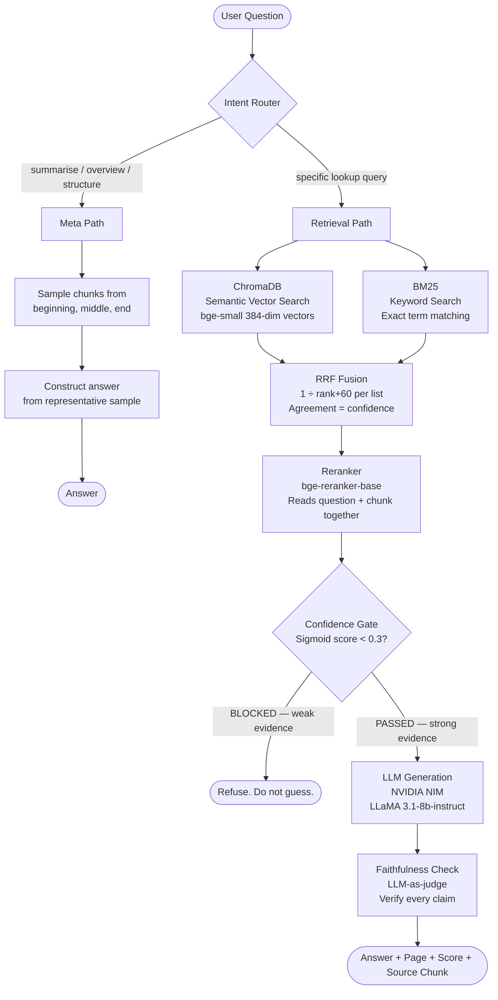
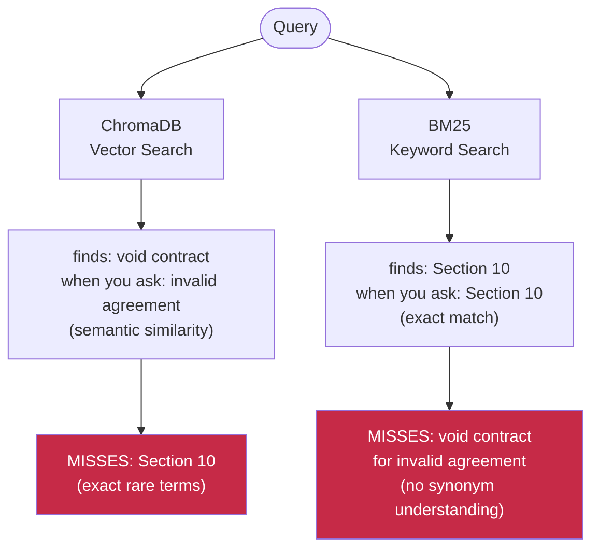
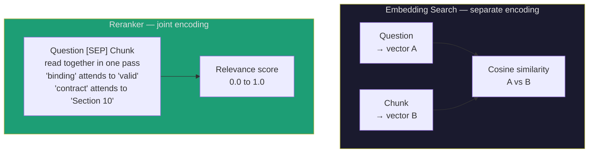
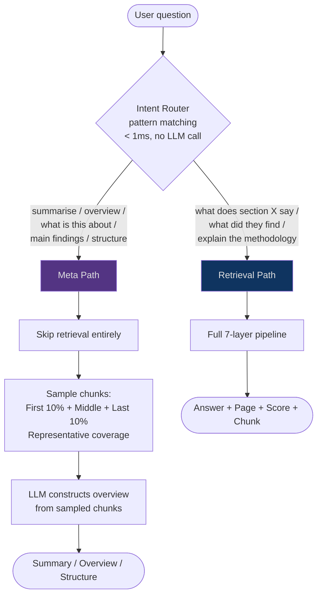
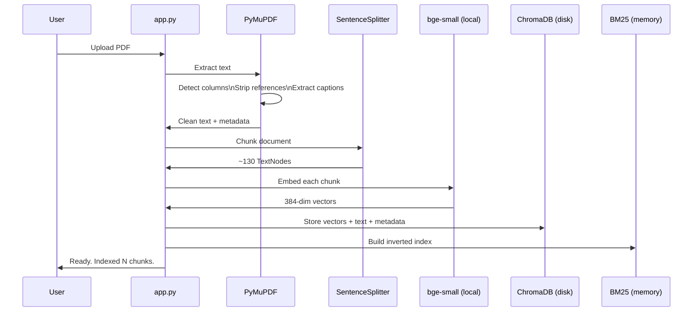
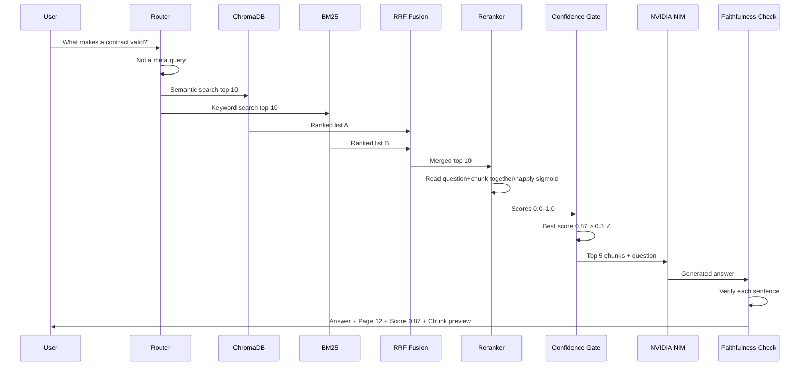

<div align="center">

# LexAI

### Research Document Intelligence System

**Ask anything about your research paper.**
**Every answer traced. Every claim proven. Zero hallucinations by design.**


</div>

---

## What Is LexAI

LexAI is a production-grade Retrieval-Augmented Generation system built specifically for research students who need to interrogate academic papers with verifiable, source-traced answers.

Most AI tools hallucinate. They mix the document's content with their own training knowledge and present both with equal confidence. A research student cannot tell which is which. They cannot cite an AI response. They cannot trust it for academic work.

LexAI solves this with one hard rule:

> **Every answer comes from the uploaded document with a source citation, or it is not given at all.**

---

## The Problem This Solves

| What students face | What LexAI does |
|---|---|
| Dense 60-page papers with no semantic search | Hybrid search finds meaning AND exact terms across the full document |
| AI answers they cannot cite or verify | Every answer shows page number, section, and source chunk |
| Tools that truncate long documents | Entire document chunked and indexed — page 1 and page 58 equally accessible |
| Confident wrong answers from AI | Confidence gate refuses weak-evidence answers instead of guessing |
| No way to navigate document structure | Meta-query path handles summarise, overview, structure queries separately |

---

## Architecture Overview



---

## The 7-Layer Anti-Hallucination Pipeline

Every query passes through seven layers. Each layer exists because the one before it has a specific weakness.


### Layer 1 — Smart Ingestion
**Problem it solves:** Basic PDF extraction destroys two-column layouts and misses figure captions.

**Decision:** PyMuPDF with layout-aware extraction reads columns in correct reading order. References section stripped before chunking — "attention", "BERT", "transformer" in references no longer pollute retrieval results. Figure and table captions extracted as dedicated chunks with metadata tags so BM25 can find them precisely.

---

### Layer 2 — Semantic Chunking
**Problem it solves:** Naive character splitting cuts sentences mid-meaning.

**Decision:** `SentenceSplitter` at 512 tokens with 50-token overlap. Respects sentence boundaries. The 50-token overlap ensures no legal clause or research finding is split across chunk boundaries — the last sentence of chunk N becomes the first sentence of chunk N+1.

---

### Layer 3 — Hybrid Retrieval
**Problem it solves:** Pure vector search misses exact rare terms. Pure keyword search misses synonyms.



**Decision:** Run both independently. Each covers the other's blind spot.

---

### Layer 4 — Reciprocal Rank Fusion
**Problem it solves:** Two ranked lists need to be merged intelligently. A chunk appearing in both lists is stronger evidence than one appearing in only one.

**The formula:**
```
RRF Score = Σ  1 / (rank + 60)
             across all retrievers

Chunk ranked #1 by both:   1/(1+60) + 1/(1+60) = 0.0328
Chunk ranked #1 by one:    1/(1+60) + 0         = 0.0164
```

The constant 60 smooths the curve so rank #1 is not astronomically better than rank #2. Agreement between two independent search methods is a strong signal of genuine relevance.

---

### Layer 5 — Reranker
**Problem it solves:** Embedding search encodes question and chunk *separately* and compares them after the fact. They never read each other.



**Decision:** `bge-reranker-base` cross-encoder reads question and chunk together. Self-attention runs across all tokens from both simultaneously. Dramatically more precise than cosine similarity alone. Raw logit output converted via sigmoid to 0–1 before threshold comparison.

**Why sigmoid matters:**
```
Raw reranker logit range: -10 to +10
Threshold of 0.3 blocks everything (logits never exceed 0.3)

After sigmoid: 1 / (1 + e^(-x))
  -8.0 → 0.0003   (correctly blocked)
  -4.0 → 0.018    (weak, blocked)
   0.0 → 0.500    (neutral)
  +4.0 → 0.982    (strong, passed)
  +8.0 → 0.9997   (near certain)

Now threshold of 0.3 works exactly as intended.
```

---

### Layer 6 — Confidence Gate
**Problem it solves:** Weak evidence fed to an LLM produces hallucination. The LLM fills gaps from training knowledge when context is thin.

**Decision:** Hard threshold at sigmoid score 0.3. Below it — refuse. The system says "The document does not contain sufficient information to answer this question confidently." and shows the best score it found.

> A refused answer is infinitely better than a hallucinated one.

---

### Layer 7 — Faithfulness Check
**Problem it solves:** Even with strong retrieval, the LLM can add unsupported claims in generation.

**Decision:** LLM-as-judge. After generation, each sentence is verified: *"Is this claim directly supported by the context chunks? Answer YES or NO."* Unsupported sentences are flagged before the user sees them.

---

## The Two Query Paths

Not all questions need retrieval. Sending "summarise this document" through a retrieval pipeline fails — no chunk talks about summarising. The intent router detects query type before any processing begins.



**Why this matters:** "Summarise this document" has no matching chunk. Retrieval returns near-zero scores. The confidence gate blocks it. The user gets a wrong refusal. The meta path fixes this by bypassing retrieval entirely and sampling across the full document instead.

---

## Technical Decisions Log

Every significant decision and the reasoning behind it.

| Decision | Alternative considered | Why this choice |
|---|---|---|
| `bge-small` not `bge-large` | bge-large (1024-dim, 1.3GB) | 1.6GB RAM ceiling — bge-large alone exceeds available RAM |
| ChromaDB persistent on disk | In-memory vector store | Disk persistence means re-embedding happens once, not every run |
| BM25 alongside ChromaDB | Vector search only | BM25 catches exact legal/technical terms vector search blurs |
| RRF for fusion | Weighted average of scores | RRF uses rank not magnitude — immune to score scale differences between retrievers |
| Cross-encoder reranker | No reranker | Cosine similarity compares embeddings separately. Cross-encoder reads both together — 10x more precise |
| Sigmoid on reranker output | Raw logit comparison | Raw logits range -10 to +10. Threshold of 0.3 blocks everything. Sigmoid normalises to 0–1. |
| Confidence gate at 0.3 | Always attempt answer | Weak evidence + LLM = hallucination. Refusing is correct behaviour. |
| `CondensePlusContextChatEngine` | `RetrieverQueryEngine` | Chat engine rewrites follow-up questions using history before retrieval. "Explain it" becomes "Explain consideration in contract law." |
| `ChatMemoryBuffer` 3000 tokens | Full history | 3000 history + 2000 chunks + 1000 answer = 6000 tokens. LLaMA context window is 8192. Safe margin. |
| PyMuPDF over pdfminer | SimpleDirectoryReader default | PyMuPDF reads two-column layouts in correct order. pdfminer interleaves columns. |
| Strip references section | Keep all text | References contain high-frequency technical terms that pollute retrieval results |
| Caption chunks with metadata | Captions in surrounding text | Dedicated chunks let BM25 find "Figure 3" precisely instead of competing with paragraph context |
| NVIDIA NIM for LLM | Local Ollama | Local LLMs crashed the system at 1.6GB RAM. NVIDIA NIM offloads compute to cloud. Zero local GPU. |

---

## System Design

### Data Flow — Ingestion



### Data Flow — Query



---

## Hardware Constraints and Solutions

This system was built and runs on a machine with **1.6GB available RAM**. Every architectural decision was shaped by this constraint.

```
Component          RAM Usage    Decision
─────────────────  ─────────    ────────────────────────────────
bge-small          ~130MB       Chose small over large (1.3GB)
bge-reranker-base  ~90MB        Fits within constraint
ChromaDB           ~50MB        Disk-based, not in-memory
BM25 index         ~30MB        In-memory but small for 130 chunks
App overhead       ~100MB       Minimal Python process
─────────────────  ─────────
Total              ~400MB       Well within 1.6GB ceiling

LLaMA 3.1-8b       ~16GB        → Offloaded to NVIDIA NIM cloud
                                   Zero local RAM usage for LLM
```

---

## Evaluation

### RAGAS Metrics

| Metric | What it measures | Score |
|---|---|---|
| Faithfulness | % of answer claims directly supported by source chunks | — |
| Answer Relevance | How well the answer addresses the actual question | — |
| Context Precision | % of retrieved chunks that were actually useful | — |
| Context Recall | % of relevant document content that was retrieved | — |

*Scores populated after evaluation run. See `evaluate.py`.*

### Benchmark Methodology

20 questions manually written from the test document with known correct answers. System run against all 20. Results categorised as correct citation, correct refusal, wrong answer, or wrong refusal.

---

## Project Structure

```
lexai/
├── main.py              # Core RAG pipeline — 7 layers
├── app.py               # Streamlit UI
├── evaluate.py          # RAGAS evaluation suite
├── data/                # Drop PDFs here
├── chroma_db/           # ChromaDB persistent storage (auto-created)
├── .env                 # API keys (never committed)
├── .env.example         # Template — shows required keys
├── requirements.txt     # All dependencies
└── README.md
```

---

## Setup

**1. Clone and create environment**
```bash
git clone https://github.com/yourusername/lexai.git
cd lexai
python -m venv venv
source venv/bin/activate        # Windows: venv\Scripts\activate
pip install -r requirements.txt
```

**2. Install the reranker dependency**
```bash
pip install git+https://github.com/FlagOpen/FlagEmbedding.git
```

**3. Set up environment variables**
```bash
cp .env.example .env
# Add your NVIDIA NIM API key to .env
```

**4. Add your document**
```bash
# Drop any PDF into the data/ folder
cp your_paper.pdf data/
```

**5. Run**
```bash
python main.py
# First run: embeds document (~2-3 min, once only)
# Subsequent runs: loads from disk (instant)
```

---

## Usage

```
⚖️  LEXAI — Ready for Queries
────────────────────────────────────────────────────────────

You: What methodology did they use?

[Thinking...]

⚖️  Compass: The authors employed a transformer-based
architecture with multi-head self-attention...

──────────────────────────────────────────────────────
📄 Grounded in:
  [1] Page 4  |  Reranker score: 0.9234
      "We propose a model architecture eschewing
       recurrence and instead relying entirely..."
  [2] Page 5  |  Reranker score: 0.8711
      "The encoder maps an input sequence of symbol..."
──────────────────────────────────────────────────────

You: summarise the document

[Meta-query detected — sampling document...]

⚖️  Compass: This paper introduces the Transformer,
a novel sequence-to-sequence architecture that...

You: check
  Faithfulness checking: ON

You: exit
Goodbye! ⚖️
```

### Special Commands

| Command | Action |
|---|---|
| `reset` | Clear conversation memory, start fresh |
| `history` | Show conversation history so far |
| `check` | Toggle faithfulness verification on/off |
| `exit` | Quit |

---

## Known Limitations

These are documented honestly — not buried in fine print.

| Limitation | Status |
|---|---|
| Cannot read graphs, charts, or figures | By design — vision model not in scope |
| Complex equations may not extract correctly | Surrounding explanation usually survives |
| Cannot teach concepts not in the document | By design — this is a retrieval system not a tutor |
| Cannot search the internet or other papers | By design — answers come from uploaded document only |
| Scanned PDFs require OCR | Partial support via PyMuPDF fallback |
| Tables extract as text approximation | Caption extraction covers most use cases |

---

## What This Is Not

- Not a concept explainer — if you do not understand what a p-value is, use a textbook
- Not a paper discovery tool — bring your own document
- Not a writing assistant — it reads papers, it does not write them
- Not a search engine — it answers from one uploaded document at a time

---

## Stack

| Component | Technology | Purpose |
|---|---|---|
| Framework | LlamaIndex | RAG orchestration |
| Vector DB | ChromaDB | Semantic search storage |
| Embeddings | BAAI/bge-small-en-v1.5 | Local text encoding (384-dim) |
| Keyword search | BM25Retriever | Exact term matching |
| Fusion | QueryFusionRetriever (RRF) | Merge ranked lists |
| Reranker | BAAI/bge-reranker-base | Cross-encoder precision scoring |
| LLM | LLaMA 3.1-8b-instruct | Answer generation (NVIDIA NIM) |
| PDF extraction | PyMuPDF | Layout-aware text extraction |
| UI | Streamlit | Web interface |
| Auth | Supabase + Google OAuth | User authentication |
| Database | Supabase PostgreSQL | Conversation persistence |
| Deployment | Streamlit Community Cloud | Hosting |

---

## Author

**Ishwarya**
AI/ML Engineer · Building systems that are either right or silent.

---

<div align="center">

*LexAI — because a refused answer is infinitely better than a hallucinated one.*

</div>
